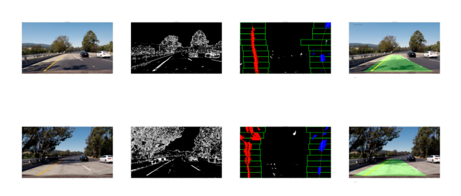

**Advanced Lane Finding Project**

The goals / steps of this project are the following:

* Compute the camera calibration matrix and distortion coefficients given a set of chessboard images.
* Apply a distortion correction to raw images.
* Use color transforms, gradients, etc., to create a thresholded binary image.
* Apply a perspective transform to rectify binary image ("birds-eye view").
* Detect lane pixels and fit to find the lane boundary.
* Determine the curvature of the lane and vehicle position with respect to center.
* Warp the detected lane boundaries back onto the original image.
* Output visual display of the lane boundaries and numerical estimation of lane curvature and vehicle position.

### Project Files 
* advanced-lane-finding.ipynb
* writeup_template.md

#### Camera Calibration

The code for this step is contained in the first code cell of the IPython notebook located in "advanced-lane-finding.ipynb" 

I start by preparing "object points", which will be the (x, y, z) coordinates of the chessboard corners in the world. Here I am assuming the chessboard is fixed on the (x, y) plane at z=0, such that the object points are the same for each calibration image.  Thus, `objp` is just a replicated array of coordinates, and `objpoints` will be appended with a copy of it every time I successfully detect all chessboard corners in a test image.  `imgpoints` will be appended with the (x, y) pixel position of each of the corners in the image plane with each successful chessboard detection.  

I then used the output `objpoints` and `imgpoints` to compute the camera calibration and distortion coefficients using the `cv2.calibrateCamera()` function.  I applied this distortion correction to the test image using the `cv2.undistort()` function and obtained the result

### Pipeline (single images)
in order to process a single image I took the following steps 
  #### 1. Resize the image 
        * Resize the image to a fixed size of 720 X 405
  #### 2. Do color transforms 
        * Convert the image to HLS color space and separate the S channel
        * Convert the image to greysacle
  #### 3. Apply sobel transform in both X and Y directions to calculate the gradient
  
 Initially a number of combinations of color and gradient thresholds were attempted. It was found that none of these were very robust to changing conditions in lighting and contrast. I used a sobel detector and calculated gradient in the x and y directions this solved the problem 
 
        * Apply threshold on the results  
        * Also apply threshold on the S channel and combine the results 

  #### 4. Perform a perspective transform 
  I then changed to a top doen perspective to better facilitate the lane detection as an un transformed image seemed to be missing some lane markers
        * Convert the image to a top view perspective so as to detect the lane lines 
        
        
  #### 5. Detect the lanes 
 I took a histogram of the bottom half of the image and found the bottom-most x position (or "base") of the left and right lane lines. Originally these locations were identified from the local maxima of the left and right halves of the histogram, but in my final implementation I changed these to quarters of the histogram just left and right of the midpoint. This helped to reject lines from adjacent lanes. The function then identifies ten windows from which to identify lane pixels, each one centered on the midpoint of the pixels from the window below. This effectively "follows" the lane lines up to the top of the binary image, and speeds processing by only searching for activated pixels over a small portion of the image. Pixels belonging to each lane line are identified and the Numpy polyfit() method fits a second order polynomial to each set of pixels.
       * Take a histogram of the bottom half of the image
       * Choose the number of sliding windows
       * Set height of windows
       * Step through the windows one by one
       * Identify window boundaries in x and y (and right and left)
       * Extract left and right line pixel positions
       * Fit a second order polynomial to each

 #### 6.  Calculate curvature
      * Calculate the lane center 
      * Calculate the deviation from the center

  #### 7. Draw the polyfill on the image 
  Here I retransform the image back to its original perspective after loverlaying a lane polynomial between the detected lines
       * Create an image to draw the lines on
       * Recast the x and y points into usable format for cv2.fillPoly()
       * Draw the lane onto the warped blank image
       * Combine the result with the original image
       
  
### Video 
      uses the same pipeline as a single image to process multiple frames 
