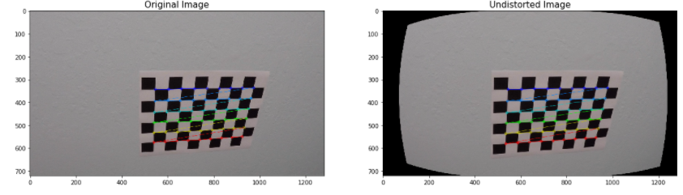

**Advanced Lane Finding Project**

The goals / steps of this project are the following:

* Compute the camera calibration matrix and distortion coefficients given a set of chessboard images.
* Apply a distortion correction to raw images.
* Use color transforms, gradients, etc., to create a thresholded binary image.
* Apply a perspective transform to rectify binary image ("birds-eye view").
* Detect lane pixels and fit to find the lane boundary.
* Determine the curvature of the lane and vehicle position with respect to center.
* Warp the detected lane boundaries back onto the original image.
* Output visual display of the lane boundaries and numerical estimation of lane curvature and vehicle position.

### Project Files 
* advanced-lane-finding.ipynb
* writeup_template.md

#### Camera Calibration

The code for this step is contained in the 3rd code cell of the IPython notebook located in "advanced-lane-finding.ipynb" and loooks  like following 
    
    img = cv2.imread(fname)
    img_size = (img.shape[1], img.shape[0])
    #convert the image to grey scale 
    gray = cv2.cvtColor(img,cv2.COLOR_BGR2GRAY)
    #calculate the corners 
    ret, corners = cv2.findChessboardCorners(gray, (nx,ny), None)
    
    # If found, add object points, image points
    if ret == True:
        objpoints.append(objp)
        imgpoints.append(corners)
        cv2.drawChessboardCorners(img, (nx,ny), corners, ret)
        # Do camera calibration given object points and image points
        ret, mtx, dist, rvecs, tvecs = cv2.calibrateCamera(objpoints, imgpoints, img_size,None,None)
        dst = cv2.undistort(img, mtx, dist, None, mtx)
        
I start by preparing "object points", which will be the (x, y, z) coordinates of the chessboard corners in the world. Here I am assuming the chessboard is fixed on the (x, y) plane at z=0, such that the object points are the same for each calibration image.  Thus, `objp` is just a replicated array of coordinates, and `objpoints` will be appended with a copy of it every time I successfully detect all chessboard corners in a test image.  `imgpoints` will be appended with the (x, y) pixel position of each of the corners in the image plane with each successful chessboard detection.  

I then used the output `objpoints` and `imgpoints` to compute the camera calibration and distortion coefficients using the `cv2.calibrateCamera()` function.  I applied this distortion correction to the test image using the `cv2.undistort()` function and obtained the result

### Pipeline (single images)

next I did color transforms and sobel transorm and combined the images
in order to process a single image I took the following steps 
  #### 1. Resize the image 
        * Resize the image to a fixed size of 720 X 405
  #### 2. Do color transforms 
        * Convert the image to HLS color space and separate the S channel
        * Convert the image to greysacle
  The code for this can be found in the cell no 7 and looks like this 
  
            # Convert to HLS color space and separate the S channel
            hls = cv2.cvtColor(img, cv2.COLOR_RGB2HLS)
            s_channel = hls[:,:,2]
            # Grayscale image
            gray = cv2.cvtColor(img, cv2.COLOR_RGB2GRAY)

  #### 3. Apply sobel transform in both X and Y directions to calculate the gradient
  
  

Initially a number of combinations of color and gradient thresholds were attempted. It was found that none of these were very robust to changing conditions in lighting and contrast. I used a sobel detector and calculated gradient in the x and y directions this solved the problem 
 
        * Apply threshold on the results  
        * Also apply threshold on the S channel and combine the results 
        
 The code for this can be found in the cell no 7 and looks like this 
 
      # Sobel x
        sobelx = cv2.Sobel(gray, cv2.CV_64F, 1, 0) # Take the derivative in x
        abs_sobelx = np.absolute(sobelx) # Absolute x derivative to accentuate lines away from horizontal
        scaled_sobel = np.uint8(255*abs_sobelx/np.max(abs_sobelx))

        # Threshold x gradient
        thresh_min = 20
        thresh_max = 100
        sxbinary = np.zeros_like(scaled_sobel)
        sxbinary[(scaled_sobel >= thresh_min) & (scaled_sobel <= thresh_max)] = 1

        # Threshold color channel
        s_thresh_min = 170
        s_thresh_max = 255
        s_binary = np.zeros_like(s_channel)
        s_binary[(s_channel >= s_thresh_min) & (s_channel <= s_thresh_max)] = 1

        # Stack each channel to view their individual contributions in green and blue respectively
        # This returns a stack of the two binary images, whose components you can see as different colors
        color_binary = np.dstack(( np.zeros_like(sxbinary), sxbinary, s_binary))

  #### 4. Perform a perspective transform 
  I then changed to a top doen perspective to better facilitate the lane detection as an un transformed image seemed to be missing some lane markers
        * Convert the image to a top view perspective so as to detect the lane lines 
     
  
  the code to do this is in cell 4 and looks like this 
  
      def corners_unwarp(img, nx, ny, mtx, dist):
        img = cv2.resize(img, (720, 405))
        # 1) Undistort using mtx and dist
        img = cv2.undistort(img, mtx, dist, None, mtx)
        apex, apey = 360, 258
        offset_far = 50
        offset_near = 10
        src = np.float32([[int(apex-offset_far),apey],
                          [int(apex+offset_far),apey],
                          [int(0+offset_near),390],
                          [int(720-offset_near),390]])
        dst = np.float32([[0,0],[720,0],[0,405],[720,405]])
        perspective_M = cv2.getPerspectiveTransform(src, dst)
        top_down = cv2.warpPerspective(img,  perspective_M, (img.shape[1], img.shape[0]), flags=cv2.INTER_LINEAR)
        return top_down,perspective_M
        
  #### 5. Detect the lanes 
 I took a histogram of the bottom half of the image and found the bottom-most x position (or "base") of the left and right lane lines. Originally these locations were identified from the local maxima of the left and right halves of the histogram, but in my final implementation I changed these to quarters of the histogram just left and right of the midpoint. This helped to reject lines from adjacent lanes. The function then identifies ten windows from which to identify lane pixels, each one centered on the midpoint of the pixels from the window below. This effectively "follows" the lane lines up to the top of the binary image, and speeds processing by only searching for activated pixels over a small portion of the image. Pixels belonging to each lane line are identified and the Numpy polyfit() method fits a second order polynomial to each set of pixels.
       * Take a histogram of the bottom half of the image
       * Choose the number of sliding windows
       * Set height of windows
       * Step through the windows one by one
       * Identify window boundaries in x and y (and right and left)
       * Extract left and right line pixel positions
       * Fit a second order polynomial to each

The code for this is in cell 8 in advance-lane-finding.ipynb

 #### 6.  Calculate curvature
      * Calculate the lane center 
      * Calculate the deviation from the center
      
 the function also calculates the center of the lane and determines the camera position in respect to the read and also calulates the approximate turning radius and steering angle
 
 The code for this is in cell 12 in advance-lane-finding.ipynb

  #### 7. Draw the polyfill on the image 
  Here I retransform the image back to its original perspective after overlaying a lane polynomial between the detected lines
       * Create an image to draw the lines on
       * Recast the x and y points into usable format for cv2.fillPoly()
       * Draw the lane onto the warped blank image
       * Combine the result with the original image
  The code for this is in cell 13 in advance-lane-finding.ipynb
  
### Video 
Uses the same pipeline as a single image to process multiple frames it reads the video frame by frame and then processes each frame and saves the output in project_video_out6.mp4 the code looks like the following and represents the entire pipeline 

    def video_pipeline(img):   
        img = cv2.resize(img, (720, 405))
        thresholded = pipeline(img)
        unwarped, perspective_M = corners_unwarp(thresholded, nx, ny, mtx, dist)
        leftx, lefty, rightx, righty, out_img  = make_histogram(unwarped)
        ploty = np.linspace(0, img.shape[0], num=img.shape[0])
        left_curverad, right_curverad,camera_pos,steering_angle,turning_radius = calculate_curvature(leftx, lefty, rightx, righty, out_img, ploty,thresholded)
        left_fit = np.polyfit(lefty, leftx, 2)
        left_fitx = left_fit[0]*ploty**2 + left_fit[1]*ploty + left_fit[2]
        right_fit = np.polyfit(righty, rightx, 2)
        right_fitx = right_fit[0]*ploty**2 + right_fit[1]*ploty + right_fit[2]
        result = overlay_lane(img,unwarped,left_fitx,right_fitx,ploty,camera_pos,steering_angle[0],turning_radius[0])
        return result

### Discussion
This highlighted, that I need to improve my understanding of color spaces, sobel and threshold combinations.
I included a basic algorithm to remove pavement colors from the images using a centre, left and right focal point. 
Another issue faced was using the previous curvature radius to determine if this line was sane or not.also another issue was that the left lane line was slightly outside the yellow line the whole time somehow the left side of the  overlay was skewd in the perspective transform to overlay the image 

#### Opportunities for improvement 
include automatically detecting the src points for warp, handling bounce in the road and understanding surface height (above road) of the camera and its impact.The algorithm could also be made to make predictions about the line when there is gaps. This would be easier with continuous lines then dashed.It would also fail if there was a road crossing or a need to cross lanes or to exit the freeway.Rain and snow would also have an impact and I’m not sure about night time.
Tail gating a car or a car on a tighter curve would potentially interrupt the visible camera and hence line detection.

